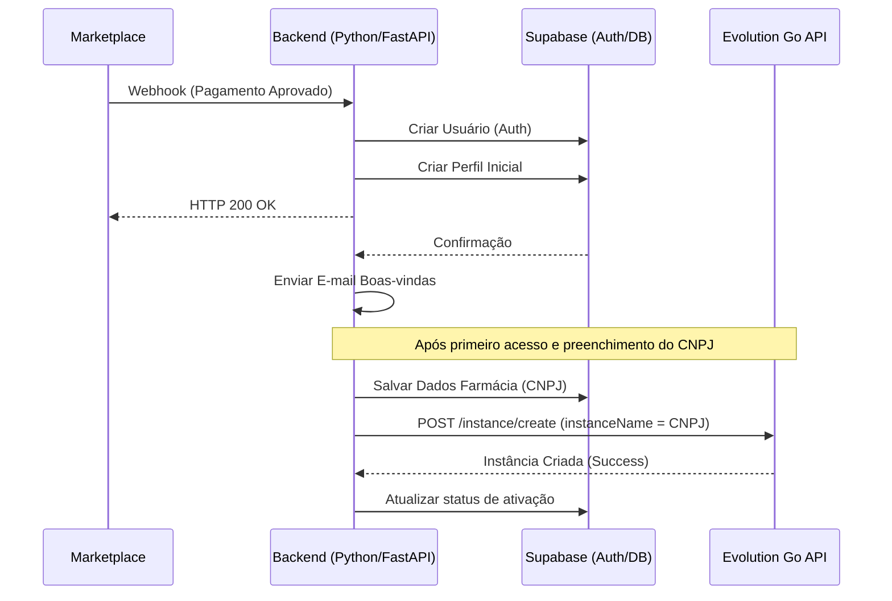
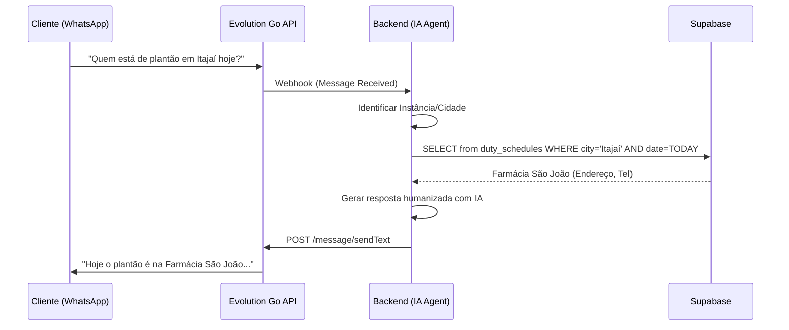

# Flow Specification: Motor de Plantão

## 1. Fluxo de Onboarding e Provisionamento (CNPJ)

## 2. Fluxo do Agente de IA (Atendimento)

## 3. Fluxo de Autoalimentação (Context Skills)

1. IA detecta pergunta sobre "Convênio X".
2. IA não encontra na base -> Responde "Não tenho essa info, vou verificar".
3. IA salva log em `ai_context_logs` com `was_resolved = FALSE`.
4. Dashboard Admin sinaliza: "Nova dúvida recorrente sobre Convênios".
5. Admin valida a resposta -> Sistema atualiza a base de conhecimento.
